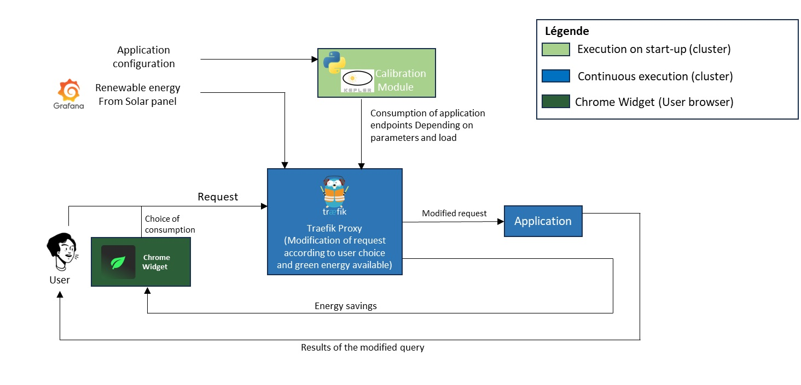

# *EN*d-user *I*nvolvement in the *E*nergy *C*onsumption of their *A*pplications : `ENIECA` - Traefik Middleware

## Overview
In 2020, digital consumption contributed to 11% of overall energy consumption, with a focus on data center infrastructure. ENIECA proposes a human-centric approach to reduce energy consumption from a software perspective.

## Technologies
- Traefik Proxy
- Kepler (software probe for estimating application consumption)
- Chrome Extension (for user interaction)

## Project Architecture


## Proposed Solution
The ENIECA Middleware provides a two-fold solution:

### Deployment Phase
- Estimate application consumption configurations based on developer-provided information using the Kepler software probe.

### Runtime Phase
- Adapt application configurations dynamically based on available renewable energy.
- Modify user requests according to the selected consumption mode.

## Stakeholders
<div style="float: left; width: 50%;">
    <h3>Supervisors</h3>
    <ul>
        <li>Anas Mokhtari</li>
        <li>Baptiste Jonglez</li>
        <li>Thomas Ledoux</li>
    </ul>
</div>

<div style="float: right; width: 50%;">
<h3>Contributors</h3>
    <ul>
        <li>Thomas Hamon</li>
        <li>Yoann Périquoi</li>
        <li>Paul Vautier</li>
        <li>Matthis Houlès</li>
    </ul>
</div>


### Involvement of...
#### Developers
- Provide different scenarios of application functionalities through a configuration file. No source code modification is required.

#### Users
- Users are increasingly conscious of their carbon footprint. The middleware offers them choices through a Chrome Extension with three modes: Economic, Balance, and Performance.

## Energy Consumption Modes
### Economic Mode
Minimal consumption configuration.
  
### Balance Mode
Maximizes Quality of Experience (QoE) considering the remaining green energy.

### Performance Mode
Utilizes remaining green energy for maximum QoE configuration.

## Usage

Deploy the middleware with this configuration schema : 

```yaml

duration: int # Duration in seconds for each configuration intervals
urlGreenEnergy: string # url for retrieving the green energy from G5k machines  
endpoints: # List of all endpoints configurations 
  - name: string # The relative path for an endpoint to be intercepted (hostname omitted. Ex : /endpoint) 
    redirect: string # The relative path for redirection (formatted in /endpoint/{:<paramName>})
    parameters: # Existing parameters and their type to be used when redirecting
      - name: string # The name of the parameter to be used in query or path params 
        type: string # path or query
    benchmark: # List of benchmark for different configurations of the endpoints
      - qoe: number # The relative quality of experience, used to determine base case for minimal and maximal configurations, and in case of equal consumption
        meanRps: float # unused 
        medianRps: int # unused  
        minRps: int #unused  
        maxRps: int #unused 
        meanJoulesPerRequest: float # unused
        medianJoulesPerRequest: float # The median consumption of the endpoint per request
        medianJoulesPerRequest: float # unused
        medianJoulesPerRequest: float # unused
        maxJoulesPerRequest: float # unused
        minJoulesPerRequest: float # unused
        parameters: # Parameters value for the current benchmark
          - name: string 
            value: string 
          - name: string 
            value: string
```
